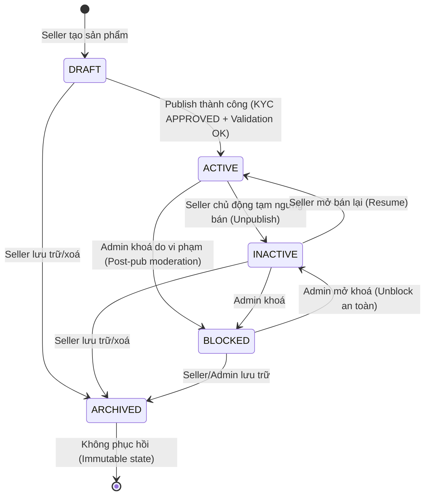

# Database Design — Product Catalog Service

> Ngày cập nhật: 2026-09-24 · Vai trò: `cecilia-db` (v18) · Chế độ: `CONTROLLED`  
> Tài liệu đầu vào: `product-catalog-docs/docs/db/product-catalog.md` · `product-catalog-docs/docs/lld/product-catalog.md` · `product-catalog-docs/docs/api/product-catalog.md`  
> Công nghệ lõi: **MongoDB 8.x** · ODM: **Mongoose 8.x** (Node.js/NestJS) · Cơ chế CDC: **Debezium MongoDB Outbox Event Router** · Database name: `product_catalog`  
> Trạng thái: `HOÀN THIỆN` (Đã tích hợp các phát hiện review [B-01], [SF-01], [Q-01], [SG-01] theo chỉ đạo của Cecilia)

---

## 1. Conventions (Quy ước dữ liệu)

| Tiêu chuẩn | Quy định thiết kế | Ràng buộc kỹ thuật & Rationale |
|---|---|---|
| **Collection Naming** | Chữ thường, số nhiều, snake_case | Ví dụ: `products`, `skus`, `categories`, `outbox_events`. |
| **Primary Key (`_id`)** | String UUIDv7 (lowercase), ngoại trừ snapshot ID | Dùng UUIDv7 dạng chuỗi 36 ký tự (`01912f31-7a1b-7c12-9c55-8b1c34a6d921`). Sắp xếp thời gian tự nhiên (time-sortable), tối ưu B-Tree indexing. Không dùng ObjectID tự sinh của MongoDB để đảm bảo tính đồng nhất cross-service ID. Riêng `shop_snapshots` dùng `shop_id`, `inventory_projections` dùng `sku_id` làm `_id` — các collection này tận dụng luôn clustered unique index mặc định của MongoDB trên `_id` (`_id_`), bảo đảm uniqueness và point-lookup đạt hiệu năng cao nhất mà không bị trùng lặp index overhead ([SG-01]). |
| **Timestamps** | BSON `Date` (UTC) | Tự động cập nhật qua Mongoose `{ timestamps: { createdAt: 'created_at', updatedAt: 'updated_at' } }`. API serialize ra chuẩn ISO-8601 UTC kết thúc bằng `Z`. Tuyệt đối không lưu local time. |
| **Tiền tệ (Money)** | BSON `Long` (64-bit Signed Integer) | **Cấm tuyệt đối** floating-point (`Double`) và `Decimal128` trong baseline tiền VND. Đơn vị: Đồng (VND). Giới hạn kiểm tra: `1 <= price <= 999999999999`. Lưu trữ BSON `Long`, domain entity dùng kiểu native `BigInt`. Khi serialize ra JSON response, `ResponseEnvelopeInterceptor` ép kiểu an toàn sang integer `number` vì giá VND `<= 999.999.999.999` hoàn toàn nằm sâu dưới `Number.MAX_SAFE_INTEGER` ($9 \times 10^{15}$), bảo đảm 100% khớp API Spec §1.2 ([Q-01]). Phép nhân/chia chiết khấu làm tròn số nguyên chẵn (banker's rounding) tại application layer trước khi lưu DB. |
| **Thuế suất (Tax Rate)** | BSON `Int32` (Basis Points - `bps`) | 1% = 100 bps (ví dụ: VAT 10% = 1000 bps, 5% = 500 bps, 0% = 0 bps). Khoảng hợp lệ: `0 <= tax_rate_bps <= 10000`. Cấm float để đảm bảo công thức tính thuế là phép chia nguyên hoàn hảo: `tax = (price * bps) / (10000 + bps)`. |
| **Concurrency Control** | Optimistic Concurrency Control với `version: Long` | Mọi aggregate root (`products`, `skus`, `categories`) bắt buộc có trường `version` kiểu số nguyên 64-bit bắt đầu từ `1`. Khi mutate, thực hiện atomic findAndModify: `{ _id, version: currentVersion }` kèm `$inc: { version: 1 }`. Mismatch trả lỗi `409 PRODUCT_VERSION_CONFLICT`. |
| **Soft Delete** | Trạng thái vòng đời `ARCHIVED` | Không dùng hard-delete trong v1. Sản phẩm, SKU, danh mục khi xoá đều chuyển `status: "ARCHIVED"`. Trường `archived_at: Date` được đánh dấu. Không hỗ trợ trạng thái `DELETED` trong catalog v1. |
| **Tenant Isolation** | Thuộc tính `shop_id` trên mọi document liên quan | Bắt buộc index dẫn đầu bởi `shop_id` cho seller queries. Application layer trích xuất `shop_id` từ Gateway JWT context (`X-User-Shop-Scope`), tuyệt đối không tin payload gửi từ body request. |
| **Cross-service FK** | Chỉ lưu ID tham chiếu logic + snapshot metadata | Không tạo liên kết FK sang database service khác (Auth-User, Inventory, Order). Chỉ lưu `shop_id`, `sku_id`, `actor_user_id` dưới dạng string. |
| **Outbox & CDC** | Collection `outbox_events` dạng Write-Only | Ứng dụng ghi event vào `outbox_events` trong cùng MongoDB Transaction với domain mutation. Debezium MongoDB Outbox Event Router đọc Oplog/Change Streams để relay sang Kafka. Không polling, không cập nhật ngược trạng thái publish vào DB. |

### 1.1 Serialization Tiền tệ: BSON Long / BigInt ↔ JSON Response (Quyết định [Q-01])

Để bảo đảm tính nhất quán tuyệt đối giữa Cơ sở dữ liệu, Application Domain và API Contract:
1. **Database Layer (MongoDB 8.x / Mongoose 8.x)**: Lưu trữ trường giá dưới dạng BSON `Long` (64-bit Signed Integer). Cấm tuyệt đối kiểu `Double` (Floating point) và `Decimal128` nhằm loại bỏ triệt để sai số dấu phẩy động.
2. **Domain / Entity Layer (TypeScript / NestJS)**: Biểu diễn trường giá bằng kiểu dữ liệu nguyên bản ECMAScript `BigInt`. Mọi phép tính toán (chiết khấu, min price) đều thực hiện trên số nguyên, ngăn ngừa rủi ro trôi số học.
3. **HTTP Serialization Layer (`ResponseEnvelopeInterceptor`)**: 
   - Tiêu chuẩn JSON không hỗ trợ kiểu `BigInt` nguyên bản (gọi `JSON.stringify` trực tiếp trên `BigInt` sẽ văng lỗi `TypeError: Do not know how to serialize a BigInt`).
   - `ResponseEnvelopeInterceptor` (NestJS) tự động duyệt cây kết quả và ép kiểu an toàn các trường `BigInt` sang JavaScript integer `number` (`Number(val)`).
   - **Chứng minh an toàn số học**: Giới hạn tối đa của giá VND trong toàn hệ thống là `999.999.999.999` VND ($< 10^{12}$ VND), trong khi ngưỡng giới hạn an toàn của số nguyên IEEE-754 trong JavaScript là `Number.MAX_SAFE_INTEGER = 9.007.199.254.740.991` ($\approx 9 \times 10^{15}$). Biên độ an toàn chênh lệch hơn 9.000 lần. Do đó, việc ép kiểu sang `number` khi ra JSON là an toàn tuyệt đối 100%, không bao giờ mất độ chính xác, khớp hoàn hảo với quy định tại **API Spec §1.2** ("tiền là integer VND").

---

## 2. Relations (Sơ đồ quan hệ & Liên kết Logic)

```
                  ┌──────────────────────┐
                  │    shop_snapshots    │ (Auth User Projection)
                  └──────────┬───────────┘
                             │ 1
                             │ belongs_to
                             ▼ *
┌────────────────┐ *       ┌──────────────┐ 1       * ┌───────────────┐
│   categories   │◄────────┤   products   ├──────────►│ product_media │
└───────┬────────┘         └──────┬───────┘           └───────────────┘
        │ 1                       │ 1
        │ receives                │ contains
        ▼ *                       ▼ *
┌──────────────────┐       ┌──────────────┐ 1       * ┌────────────────────────┐
│product_categories│       │     skus     ├──────────►│ inventory_projections  │
└──────────────────┘       └──────────────┘           │ (Inventory Projection) │
                                  │ 1                 └────────────────────────┘
                                  │ emits
                                  ▼ *
                    ┌────────────────────────────┐
                    │       outbox_events        │ ──► [Debezium CDC] ──► Kafka
                    ├────────────────────────────┤
                    │       catalog_audits       │
                    └────────────────────────────┘
```

### Bảng chi tiết quan hệ giữa các Collection

| Quan hệ | Loại quan hệ | Khoá tham chiếu | Hành vi khi bản ghi cha bị xoá/lưu trữ (`ARCHIVED`) |
|---|---|---|---|
| `products` → `skus` | 1 - N | `skus.product_id` → `products._id` | `RESTRICT`: Không cho phép archive product nếu SKU đang có đơn hàng pending; khi product chuyển `ARCHIVED`, toàn bộ SKU liên thuộc tự động chuyển `ARCHIVED` trong cùng transaction. |
| `products` → `product_media` | 1 - N | `product_media.product_id` → `products._id` | `CASCADE_STATUS`: Metadata media giữ nguyên để đối soát audit, chuyển trạng thái `status: "DELETED"` logic khi seller xoá media khỏi SPU. |
| `products` ↔ `categories` | N - N | Qua junction collection `product_categories` | `RESTRICT`: Không cho phép archive category nếu đang có product `ACTIVE` gán vào. Gán tối đa: 1 primary + 2 secondary. |
| `categories` → `categories` | 1 - N (Self) | `categories.parent_id` → `categories._id` | `RESTRICT`: Cấm xoá/archive danh mục cha nếu còn danh mục con đang `ACTIVE`. Kiểm soát chu trình (cycle) qua `path`. |
| `products` → `shop_snapshots` | N - 1 (Logic) | `products.shop_id` → `shop_snapshots._id` | `READ_ONLY`: Snapshot cập nhật bất đồng bộ từ Kafka `auth-user`. Product không ghi ngược sang `shop_snapshots`. |
| `skus` → `inventory_projections` | 1 - 1 (Logic) | `inventory_projections._id` = `skus._id` | `READ_ONLY`: Projection cập nhật bất đồng bộ từ Kafka `inventory`. Không dùng để reserve/deduct tồn kho. |
| `products` → `outbox_events` | 1 - N | `outbox_events.aggregate_id` → `products._id` | `INDEPENDENT`: Outbox record được commit cùng transaction với mutation domain. Dọn dẹp theo chính sách Oplog/TTL retention. |
| `products` → `catalog_audits` | 1 - N | `catalog_audits.target_id` → `products._id` | `IMMUTABLE`: Bản ghi kiểm toán không bao giờ bị sửa hoặc xoá. Lưu trữ vĩnh viễn theo chính sách audit compliance. |

---

## 3. Collections (Đặc tả chi tiết 10 Mongoose Schemas)

### 3.1 `products` — Aggregate Root Quản lý Sản phẩm (SPU)
Document đại diện cho thông tin định danh, nội dung mô tả, giá hiển thị đại diện và vòng đời SPU.

| Thuộc tính | Kiểu dữ liệu (Mongoose/BSON) | Null | Mặc định | Ràng buộc / Validation | Ý nghĩa nghiệp vụ |
|---|---|:---:|:---:|---|---|
| `_id` | `String` (UUIDv7) | Không | — | Định dạng regex UUIDv7 chuẩn chữ thường | Khóa chính của sản phẩm (SPU ID). |
| `shop_id` | `String` (UUIDv7) | Không | — | Bất biến (immutable) sau khi tạo | Tenant ID sở hữu sản phẩm, trích từ actor scope. |
| `slug` | `String` | Không | — | Trim, regex `^[a-z0-9]+(-[a-z0-9]+)*$`, max 160 ký tự | URL slug thân thiện SEO, unique trong từng shop. |
| `title` | `String` | Không | — | Trim, min 3, max 200 ký tự | Tên hiển thị của sản phẩm. |
| `description` | `String` | Có | `null` | Max 100,000 ký tự, sanitize HTML allowlist | Mô tả chi tiết. Bắt buộc non-null khi chuyển `ACTIVE`. |
| `brand` | `String` | Có | `null` | Trim, max 120 ký tự | Thương hiệu sản phẩm (optional). |
| `status` | `String` (Enum) | Không | `"DRAFT"` | Enum: `DRAFT`, `ACTIVE`, `INACTIVE`, `BLOCKED`, `ARCHIVED` | Trạng thái vòng đời sản phẩm. |
| `price_summary.base_price` | `Long` (BSON Int64) | Không | — | `1 <= base_price <= 999999999999` VND | Giá niêm yết/gốc đại diện (min base_price của SKU set). |
| `price_summary.sale_price` | `Long` (BSON Int64) | Không | — | `1 <= sale_price <= base_price` VND | Giá bán khuyến mãi đại diện (min sale_price của SKU set). |
| `price_summary.currency` | `String` | Không | `"VND"` | Cố định `"VND"` | Đơn vị tiền tệ chuẩn của hệ thống. |
| `primary_category_id` | `String` (UUIDv7) | Có | `null` | Tham chiếu tới `categories._id` | Bắt buộc non-null & category phải `ACTIVE` khi publish. |
| `shop_snapshot.shop_id` | `String` | Không | — | Khớp `shop_id` | Định danh shop tại thời điểm snapshot. |
| `shop_snapshot.name` | `String` | Không | — | Tên hiển thị shop | Snapshot tên shop phục vụ PDP/Search hydration. |
| `shop_snapshot.slug` | `String` | Không | — | Slug shop | Snapshot slug shop phục vụ liên kết cửa hàng. |
| `shop_snapshot.logo_url` | `String` | Có | `null` | URL CDN hợp lệ | Logo shop hiển thị. |
| `shop_snapshot.shop_status` | `String` | Không | — | `ACTIVE`, `SUSPENDED` | Trạng thái tài khoản shop. |
| `shop_snapshot.kyc_status` | `String` | Không | — | `PENDING`, `APPROVED`, `NEEDS_INFO`, `REJECTED`, `EXPIRED` | Trạng thái KYC; bắt buộc `APPROVED` mới được publish. |
| `shop_snapshot.source_version` | `Long` | Không | — | Monotonic counter | Version event từ auth-user để chống ghi đè event cũ. |
| `shop_snapshot.updated_at` | `Date` | Không | — | ISO-8601 UTC | Thời điểm nhận event từ auth-user. |
| `rating_summary.avg` | `Number` (Double) | Có | `null` | `1.0 <= avg <= 5.0` hoặc `null` | Điểm đánh giá trung bình (cache từ `rating-comment`). |
| `rating_summary.count` | `Long` | Không | `0` | `>= 0` | Tổng số lượng đánh giá của sản phẩm. |
| `rating_summary.updated_at` | `Date` | Có | `null` | ISO-8601 UTC | Thời điểm cập nhật rating gần nhất. |
| `published_at` | `Date` | Có | `null` | UTC | Thời điểm sản phẩm được duyệt publish lần đầu. |
| `unpublished_at` | `Date` | Có | `null` | UTC | Thời điểm seller chủ động tạm ngưng bán. |
| `archived_at` | `Date` | Có | `null` | UTC | Thời điểm chuyển trạng thái lưu trữ (`ARCHIVED`). |
| `blocked_at` | `Date` | Có | `null` | UTC | Thời điểm Admin thực hiện khoá sản phẩm. |
| `block_reason` | `String` | Có | `null` | Max 500 ký tự | Lý do vi phạm chính sách do Admin ghi nhận. |
| `created_at` | `Date` | Không | Now | BSON Date UTC | Thời điểm tạo bản ghi. |
| `updated_at` | `Date` | Không | Now | BSON Date UTC | Thời điểm sửa đổi bản ghi gần nhất. |
| `version` | `Long` (BSON Int64) | Không | `1` | Bắt đầu từ 1, tăng đơn điệu | Optimistic locking token. |

### 3.2 `skus` — Phiên bản Sản phẩm & Quản lý Biến thể (Stock Keeping Unit)
Quản lý các biến thể vật lý/thương mại của sản phẩm. Tách riêng khỏi collection `products` để tránh giới hạn kích thước document 16MB và tối ưu ghi SKU độc lập.

| Thuộc tính | Kiểu dữ liệu | Null | Mặc định | Ràng buộc / Validation | Ý nghĩa nghiệp vụ |
|---|---|:---:|:---:|---|---|
| `_id` | `String` (UUIDv7) | Không | — | UUIDv7 format | Khóa chính của SKU (`sku_id`). |
| `product_id` | `String` (UUIDv7) | Không | — | Khớp `products._id` | Khóa ngoại logic tham chiếu SPU cha. |
| `shop_id` | `String` (UUIDv7) | Không | — | Khớp `products.shop_id` | Denormalized tenant scope phục vụ query & index unique. |
| `seller_sku` | `String` | Không | — | Trim, uppercase, max 100 ký tự | Mã quản lý nội bộ của seller, unique trong cùng shop. |
| `attributes` | `Map<String, Any>` | Không | `{}` | Tối đa 50 thuộc tính, format strictly typed | Cặp `key: value` khớp với `attribute_definitions`. |
| `variant_key` | `String` | Không | — | Chuỗi canonicalized: `dim1:val1\|dim2:val2` | Khóa định danh biến thể duy nhất trong một sản phẩm. |
| `price_override` | `Long` | Có | `null` | `1 <= price_override <= 999999999999` VND | Giá bán riêng cho SKU (chỉ override `sale_price`). |
| `status` | `String` (Enum) | Không | `"DRAFT"` | Enum: `DRAFT`, `ACTIVE`, `INACTIVE`, `ARCHIVED` | Trạng thái kinh doanh của SKU. |
| `media_ids` | `Array<String>` | Không | `[]` | Tối đa 5 media IDs | Danh sách ảnh riêng đại diện cho phiên bản SKU này. |
| `created_at` | `Date` | Không | Now | UTC | Thời điểm tạo SKU. |
| `updated_at` | `Date` | Không | Now | UTC | Thời điểm cập nhật SKU. |
| `version` | `Long` | Không | `1` | Bắt đầu từ 1 | Optimistic locking token cho SKU. |

### 3.3 `attribute_definitions` — Từ điển Định nghĩa Thuộc tính Động
Cấu hình thuộc tính kỹ thuật hoặc phân loại cho Category hoặc riêng cho Product.

| Thuộc tính | Kiểu dữ liệu | Null | Mặc định | Ràng buộc / Validation | Ý nghĩa nghiệp vụ |
|---|---|:---:|:---:|---|---|
| `_id` | `String` (UUIDv7) | Không | — | UUIDv7 | Khóa chính của thuộc tính. |
| `scope_type` | `String` (Enum) | Không | — | `PRODUCT` hoặc `CATEGORY` | Phạm vi áp dụng của thuộc tính. |
| `scope_id` | `String` (UUIDv7) | Không | — | ID của Product hoặc Category tương ứng | Khóa ngoại logic gắn thuộc tính với đối tượng. |
| `key` | `String` | Không | — | Regex `^[a-z0-9_]+$`, max 64 ký tự | Khóa lập trình của thuộc tính (ví dụ: `color`, `ram_gb`). |
| `label` | `String` | Không | — | Trim, max 120 ký tự | Nhãn hiển thị giao diện tiếng Việt/Anh. |
| `type` | `String` (Enum) | Không | — | `STRING`, `NUMBER`, `BOOLEAN`, `ENUM` | Kiểu dữ liệu nghiêm ngặt của giá trị thuộc tính. |
| `is_variant_dimension` | `Boolean` | Không | `false` | Tối đa 10 dimension / product | Đánh dấu thuộc tính dùng để phân tách SKU biến thể. |
| `allowed_values` | `Array<String>` | Có | `[]` | Bắt buộc non-empty khi `type === "ENUM"` | Danh sách các giá trị hợp lệ được phép chọn. |
| `unit` | `String` | Có | `null` | Max 30 ký tự (ví dụ: `"GB"`, `"kg"`, `"cm"`) | Đơn vị đo lường hiển thị. |
| `display_as` | `String` (Enum) | Không | `"PLAIN"` | `PLAIN`, `COLOR_SWATCH`, `IMAGE_THUMB` | Gợi ý render giao diện cho Seller SKU builder. |
| `value_meta` | `Object` | Có | `null` | Map `{ [val]: { swatch_hex?, swatch_media_id? } }` | Metadata mở rộng cho mã màu hex hoặc thumbnail. |
| `sort_order` | `Int32` | Không | `0` | `>= 0` | Thứ tự ưu tiên sắp xếp hiển thị trên PDP. |
| `status` | `String` (Enum) | Không | `"ACTIVE"` | `ACTIVE`, `INACTIVE`, `ARCHIVED` | Trạng thái kích hoạt của định nghĩa. |
| `created_at` / `updated_at` | `Date` | Không | Now | UTC | Thời gian tạo và cập nhật. |

### 3.4 `categories` — Cây Danh mục Sản phẩm (Taxonomy Tree)
Quản lý cây danh mục đa cấp theo mô hình Materialized Path, hỗ trợ duyệt cây nhanh chóng và kế thừa thuế suất VAT.

| Thuộc tính | Kiểu dữ liệu | Null | Mặc định | Ràng buộc / Validation | Ý nghĩa nghiệp vụ |
|---|---|:---:|:---:|---|---|
| `_id` | `String` (UUIDv7) | Không | — | UUIDv7 | Khóa chính danh mục. |
| `parent_id` | `String` (UUIDv7) | Có | `null` | Null đối với danh mục gốc (Root) | Khóa tham chiếu danh mục cha. |
| `name` | `String` | Không | — | Trim, max 120 ký tự | Tên danh mục (unique trong cùng `parent_id`). |
| `slug` | `String` | Không | — | Regex `^[a-z0-9]+(-[a-z0-9]+)*$`, max 160 | Unique toàn bộ cây taxonomy. |
| `path` | `String` | Không | — | Regex `^(/[0-9a-f-]{36})+$` | Materialized path: `/<root_id>/<child_id>/...` |
| `depth` | `Int32` | Không | `1` | `1 <= depth <= 5` | Độ sâu của node cây (Root có depth = 1). |
| `status` | `String` (Enum) | Không | `"ACTIVE"` | `ACTIVE`, `INACTIVE`, `ARCHIVED` | Trạng thái hiển thị danh mục. |
| `sort_order` | `Int32` | Không | `0` | `>= 0` | Thứ tự hiển thị cùng cấp. |
| `tax_rate_bps` | `Int32` | Có | `null` | `0 <= tax_rate_bps <= 10000`. Root bắt buộc non-null | Thuế suất VAT theo basis points. Null = kế thừa từ cha. |
| `created_at` / `updated_at` | `Date` | Không | Now | UTC | Timestamps. |
| `version` | `Long` | Không | `1` | Tăng đơn điệu | Optimistic locking token khi sửa cấu trúc cây. |

### 3.5 `product_categories` — Bảng liên kết Phân loại Sản phẩm
Quản lý việc gán danh mục cho sản phẩm (Junction Collection) kèm cờ đánh dấu danh mục chính.

| Thuộc tính | Kiểu dữ liệu | Null | Mặc định | Ràng buộc / Validation | Ý nghĩa nghiệp vụ |
|---|---|:---:|:---:|---|---|
| `_id` | `String` (UUIDv7) | Không | — | UUIDv7 | Khóa chính bản ghi gán. |
| `product_id` | `String` (UUIDv7) | Không | — | Khớp `products._id` | Sản phẩm được phân loại. |
| `category_id` | `String` (UUIDv7) | Không | — | Khớp `categories._id` (phải `ACTIVE`) | Danh mục được gán. |
| `is_primary` | `Boolean` | Không | `false` | Đúng 1 primary khi publish; partial unique | Đánh dấu danh mục chính xác định thuế & đường dẫn breadcrumb. |
| `assigned_at` | `Date` | Không | Now | UTC | Thời điểm gán. |
| `assigned_by` | `String` (UUIDv7) | Không | — | Actor User ID | Người thực hiện gán danh mục. |

### 3.6 `product_media` — Quản lý Metadata Tệp Đa phương tiện
Lưu trữ thông tin xác thực tải lên và đường dẫn S3/MinIO. Byte dữ liệu không đi qua DB hay backend.

| Thuộc tính | Kiểu dữ liệu | Null | Mặc định | Ràng buộc / Validation | Ý nghĩa nghiệp vụ |
|---|---|:---:|:---:|---|---|
| `_id` | `String` (UUIDv7) | Không | — | UUIDv7 (`media_id`) | Khóa chính tệp media. |
| `product_id` | `String` (UUIDv7) | Không | — | Khớp `products._id` | Sản phẩm sở hữu tệp media. |
| `sku_id` | `String` (UUIDv7) | Có | `null` | Khớp `skus._id` (nếu gán cho SKU) | Biến thể cụ thể sở hữu tệp media này. |
| `scope` | `String` (Enum) | Không | `"SPU"` | `SPU` hoặc `SKU` | Phạm vi áp dụng của hình ảnh/video. |
| `object_key` | `String` | Không | — | Unique, private S3 object key | Khóa lưu trữ đối tượng trên bucket S3/MinIO. |
| `content_type` | `String` | Không | — | Allowlist: `image/jpeg`, `image/png`, `image/webp`, `video/mp4` | Định dạng MIME của tệp tin. |
| `size_bytes` | `Long` | Không | — | Ảnh: `<= 20971520` (20MiB); Video: `<= 209715200` (200MiB) | Dung lượng tệp tin tính bằng bytes. |
| `sha256` | `String` | Không | — | Hex 64 ký tự | Checksum SHA-256 xác minh tính toàn vẹn sau upload. |
| `sort_order` | `Int32` | Không | `0` | `>= 0` | Thứ tự trình chiếu ảnh trong gallery. |
| `is_cover` | `Boolean` | Không | `false` | Tối đa 1 ảnh cover READY cho mỗi SPU | Đánh dấu ảnh đại diện chính của sản phẩm. |
| `status` | `String` (Enum) | Không | `"UPLOADING"` | `UPLOADING`, `SCANNING`, `READY`, `REJECTED`, `DELETED` | Trạng thái kiểm duyệt và xử lý tệp media. |
| `uploaded_by` | `String` (UUIDv7) | Không | — | Actor User ID | Định danh người thực hiện upload. |
| `created_at` / `updated_at` | `Date` | Không | Now | UTC | Timestamps. |

### 3.7 `shop_snapshots` — Bản sao Chiếu nhanh Thông tin Shop (Auth User Projection)
Lưu trữ thông tin shop nhận từ Kafka events (`auth-user`), tối ưu hoá đọc PDP và kiểm tra điều kiện KYC.

| Thuộc tính | Kiểu dữ liệu | Null | Mặc định | Ràng buộc / Validation | Ý nghĩa nghiệp vụ |
|---|---|:---:|:---:|---|---|
| `_id` | `String` (UUIDv7) | Không | — | Dùng chính `shop_id` làm `_id` (tận dụng clustered unique index mặc định `_id_` của MongoDB) [SG-01] | Khóa chính snapshot, hỗ trợ point-lookup $O(1)$. |
| `shop_id` | `String` (UUIDv7) | Không | — | Trùng khớp với `_id`; Unique | Định danh shop trong hệ thống Auth-User. |
| `name` | `String` | Không | — | Max 150 ký tự | Tên hiển thị của cửa hàng. |
| `slug` | `String` | Không | — | Regex slug | Đường dẫn cửa hàng. |
| `logo_url` | `String` | Có | `null` | URL hợp lệ | Đường dẫn ảnh đại diện gian hàng. |
| `shop_status` | `String` | Không | — | `ACTIVE`, `SUSPENDED`, `DRAFT`, `DELETED` | Trạng thái hoạt động của gian hàng. |
| `kyc_status` | `String` | Không | — | `PENDING`, `APPROVED`, `NEEDS_INFO`, `REJECTED`, `EXPIRED` | Trạng thái xác thực gian hàng (Gate publish). |
| `source_version` | `Long` | Không | — | Monotonic counter | Version của aggregate bên Auth-User để chống out-of-order. |
| `source_event_id` | `String` (UUIDv7) | Không | — | Unique dedupe token | Định danh event từ Kafka để xử lý idempotent. |
| `updated_at` | `Date` | Không | Now | UTC | Thời điểm nhận event cập nhật. |

### 3.8 `inventory_projections` — Bản sao Chiếu nhanh Tồn kho (Inventory Projection)
Bản sao hiển thị số lượng tồn kho nhận từ Kafka events (`inventory`). Read-only đối với Product Catalog.

| Thuộc tính | Kiểu dữ liệu | Null | Mặc định | Ràng buộc / Validation | Ý nghĩa nghiệp vụ |
|---|---|:---:|:---:|---|---|
| `_id` | `String` (UUIDv7) | Không | — | Dùng chính `sku_id` làm `_id` (tận dụng clustered unique index mặc định `_id_` của MongoDB) [SG-01] | Khóa chính projection, hỗ trợ point-lookup $O(1)$. |
| `sku_id` | `String` (UUIDv7) | Không | — | Trùng khớp với `_id`; Unique | Định danh SKU đối soát tồn kho. |
| `product_id` | `String` (UUIDv7) | Không | — | Khớp `products._id` | Tham chiếu sản phẩm SPU. |
| `available_qty_snapshot` | `Long` | Không | `0` | `>= 0` | Số lượng hàng sẵn sàng bán (chỉ để hiển thị). |
| `reserved_qty_snapshot` | `Long` | Có | `null` | `>= 0` | Số lượng tạm giữ phục vụ chẩn đoán. |
| `committed_qty_snapshot` | `Long` | Có | `null` | `>= 0` | Số lượng đang vận chuyển phục vụ chẩn đoán. |
| `stock_status` | `String` (Enum) | Không | `"UNKNOWN"` | `UNKNOWN`, `IN_STOCK`, `LOW_STOCK`, `OUT_OF_STOCK`, `STALE` | Trạng thái tồn kho tính toán hiển thị cho Buyer. |
| `as_of` | `Date` | Không | — | UTC | Thời điểm chốt số liệu tại Inventory ledger gốc. |
| `source_version` | `Long` | Không | — | Monotonic counter | Version event từ Inventory để loại bỏ event cũ. |
| `source_event_id` | `String` (UUIDv7) | Không | — | Dedupe token | Chống xử lý trùng lặp event. |
| `updated_at` | `Date` | Không | Now | UTC | Thời điểm consumer cập nhật bản ghi này. |

### 3.9 `outbox_events` — Bảng Sự kiện Outbox phục vụ CDC Debezium
Collection ghi sự kiện miền nghiệp vụ (Domain Events) trong cùng Transaction. Write-only đối với application.

| Thuộc tính | Kiểu dữ liệu | Null | Mặc định | Ràng buộc / Validation | Ý nghĩa nghiệp vụ |
|---|---|:---:|:---:|---|---|
| `_id` | `String` (UUIDv7) | Không | — | UUIDv7 | Khóa chính của bản ghi outbox. |
| `event_id` | `String` (UUIDv7) | Không | — | Bắt buộc riêng biệt (khớp `_id`) | Connector map `collection.field.event.id=event_id`. |
| `aggregate_type` | `String` (Enum) | Không | — | `PRODUCT`, `SKU`, `CATEGORY`, `SHOP_PROJECTION` | Phân loại thực thể phát sinh sự kiện. |
| `aggregate_id` | `String` | Không | — | Trùng ID thực thể | Khóa phân vùng Kafka (Kafka message key) bảo đảm thứ tự. |
| `event_type` | `String` | Không | — | Ví dụ: `product.published` | Tên sự kiện nghiệp vụ chuẩn hóa. |
| `schema_version` | `Int32` | Không | `1` | Bắt đầu từ 1 | Phiên bản hợp đồng sự kiện. |
| `payload` | `Object` | Không | — | BSON Document | Nội dung chi tiết sự kiện (không chứa KYC/secrets). |
| `occurred_at` | `Date` | Không | Now | UTC | Thời điểm phát sinh sự kiện logic. |
| `topic` | `String` | Không | — | Đúng 1 trong 4 topics Kafka | Connector route topic đích theo field này (`route.by.field=topic`). |
| `version` | `Long` | Không | — | Monotonic counter | Aggregate version tại thời điểm phát sinh sự kiện. |
| `actor_user_id` | `String` | Có | `null` | UUIDv7 hoặc null | User thực hiện hành động (null nếu do background job/projection). |
| `traceparent` | `String` | Có | `null` | W3C trace context format | Tracing header đưa vào Kafka Header bởi Debezium SMT. |

### 3.10 `catalog_audits` — Bản ghi Lịch sử Kiểm toán Hoạt động Danh mục
Lưu vết mọi hành động thay đổi nhạy cảm (Tạo, Sửa, Publish, Khoá, Gán danh mục) phục vụ đối soát và compliance.

| Thuộc tính | Kiểu dữ liệu | Null | Mặc định | Ràng buộc / Validation | Ý nghĩa nghiệp vụ |
|---|---|:---:|:---:|---|---|
| `_id` | `String` (UUIDv7) | Không | — | UUIDv7 | Khóa chính bản ghi audit. |
| `actor_user_id` | `String` (UUIDv7) | Không | — | Khóa xác thực user | Người thực hiện hành động. |
| `shop_id` | `String` (UUIDv7) | Có | `null` | Tenant scope | Cửa hàng chịu ảnh hưởng nếu có. |
| `action` | `String` | Không | — | Enum hành động nghiệp vụ | `CREATE`, `UPDATE`, `PUBLISH`, `UNPUBLISH`, `ARCHIVE`, `BLOCK`, `UNBLOCK`, `CATEGORY_CHANGE`, `MEDIA_CHANGE`. |
| `target_type` | `String` (Enum) | Không | — | `PRODUCT`, `SKU`, `CATEGORY`, `MEDIA` | Thực thể đích bị tác động. |
| `target_id` | `String` | Không | — | ID của thực thể đích | Khóa định danh thực thể đích. |
| `reason` | `String` | Có | `null` | Max 500 ký tự | Lý do (bắt buộc khi Admin block/unblock). |
| `metadata` | `Object` | Có | `{}` | Key-value changed fields | Danh sách các trường dữ liệu bị thay đổi (diff metadata). |
| `occurred_at` | `Date` | Không | Now | UTC | Thời điểm ghi nhận hành động. |

---

## 4. Indexes (Thiết kế Chỉ mục & Ràng buộc Toàn vẹn)

Toàn bộ chỉ mục được thiết kế dựa trên nguyên tắc **ESR (Equality, Sort, Range)** nhằm tối ưu hóa CPU, tối thiểu bộ nhớ RAM và bảo đảm 100% ràng buộc nghiệp vụ.

| Tên Index | Collection | Danh sách Trường Chỉ mục | Thuộc tính / Partial Filter | Truy vấn / Màn hình phục vụ | Mục đích & LLD § |
|---|---|---|---|---|---|
| `idx_products_shop_slug_unique` | `products` | `{ shop_id: 1, slug: 1 }` | `unique: true` | Seller tạo/sửa SPU slug | Chống trùng slug trong cùng 1 shop (LLD §3.1). |
| `idx_products_seller_listing` | `products` | `{ shop_id: 1, status: 1, updated_at: -1 }` | Compound | `GET /seller/products` | Danh sách sản phẩm của Seller kèm filter status và phân trang (LLD §3.1). |
| `idx_products_category_listing`| `products` | `{ status: 1, primary_category_id: 1, published_at: -1 }` | Compound | `GET /products?category_id=` | Buyer xem danh sách sản phẩm theo danh mục đang active (LLD §3.7). |
| `idx_products_shop_listing` | `products` | `{ shop_id: 1, status: 1, published_at: -1 }` | Compound | `GET /shops/{shopId}/products` | Buyer xem danh sách sản phẩm của Shop đang mở bán (LLD §3.7). |
| `idx_products_status_price` | `products` | `{ status: 1, "price_summary.sale_price": 1 }` | Compound | `GET /products?min_price=&max_price=` | Lọc sản phẩm theo khoảng giá và sắp xếp theo giá (LLD §3.7). |
| `idx_skus_product_variant_unique`| `skus` | `{ product_id: 1, variant_key: 1 }` | `unique: true` | `PUT /seller/products/{id}/skus` | Đảm bảo biến thể không trùng lặp trong 1 sản phẩm (LLD §3.2). |
| `idx_skus_shop_seller_sku_unique`| `skus` | `{ shop_id: 1, seller_sku: 1 }` | `unique: true` | `PUT /seller/products/{id}/skus` | Đảm bảo SKU của seller không trùng trong toàn shop (LLD §3.2). |
| `idx_skus_product_status` | `skus` | `{ product_id: 1, status: 1 }` | Compound | `GET /products/{id}` | Lấy danh sách SKU active khi render màn hình PDP chi tiết (LLD §3.7). |
| `idx_attr_def_scope_key_unique`| `attribute_definitions` | `{ scope_type: 1, scope_id: 1, key: 1 }` | `unique: true` | Seller cấu hình biến thể | Chống trùng key thuộc tính trong cùng scope (LLD §2.4). |
| `idx_categories_slug_unique` | `categories` | `{ slug: 1 }` | `unique: true` | `GET /categories/{slug}` | Đảm bảo slug danh mục duy nhất toàn hệ thống (LLD §3.8). |
| `idx_categories_parent_nav` | `categories` | `{ parent_id: 1, status: 1, sort_order: 1 }` | Compound | `GET /categories` | Duyệt cây danh mục cấp 1, cấp 2 theo thứ tự hiển thị (LLD §3.8). |
| `idx_categories_path` | `categories` | `{ path: 1 }` | Single prefix B-Tree | Cập nhật cây danh mục | Tìm kiếm và cập nhật nhanh toàn bộ con cháu (descendants) (LLD §3.8). |
| `idx_categories_parent_name` | `categories` | `{ parent_id: 1, name: 1 }` | `unique: true` | Admin tạo category | Chống đặt tên danh mục trùng nhau dưới cùng 1 cha (LLD §3.8). |
| `idx_prod_cat_unique` | `product_categories` | `{ product_id: 1, category_id: 1 }` | `unique: true` | Gán danh mục | Chống gán trùng 1 danh mục nhiều lần cho 1 sản phẩm (LLD §3.8). |
| `idx_cat_prod_listing` | `product_categories` | `{ category_id: 1, product_id: 1 }` | Compound | Duyệt ngược danh mục | Lấy danh sách ID sản phẩm thuộc danh mục (LLD §3.8). |
| `idx_prod_cat_primary_unique`| `product_categories` | `{ product_id: 1, is_primary: 1 }` | `unique: true`, Partial: `{ is_primary: true }` | Publish policy check | **Ràng buộc cứng:** Mỗi sản phẩm chỉ có tối đa duy nhất 1 primary category (LLD §3.4). |
| `idx_media_product_gallery` | `product_media` | `{ product_id: 1, scope: 1, status: 1, sort_order: 1 }` | Compound | PDP Media Gallery | Tải danh sách ảnh/video hợp lệ theo thứ tự sắp xếp (LLD §3.9). |
| `idx_media_object_key_unique` | `product_media` | `{ object_key: 1 }` | `unique: true` | Presign Upload | Ngăn chặn tái sử dụng trùng lặp S3 object key (LLD §3.9). |
| `idx_media_product_sha256` | `product_media` | `{ product_id: 1, sha256: 1 }` | Compound | Verify upload checksum | Phát hiện seller upload trùng tệp tin trong cùng SPU (LLD §3.9). |
| `idx_media_cover_unique` | `product_media` | `{ product_id: 1, is_cover: 1 }` | `unique: true`, Partial: `{ is_cover: true, status: "READY" }` | Publish validation | **Ràng buộc cứng:** Chỉ duy nhất 1 ảnh bìa READY cho mỗi sản phẩm (LLD §3.4). |
| `idx_shop_snapshots_id` | `shop_snapshots` | `{ shop_id: 1 }` | `unique: true` | Tra cứu snapshot shop | Lấy thông tin shop để kiểm tra KYC (LLD §3.11). Ghi nhận [SG-01]: Vì `_id` đã lưu chính `shop_id` (có sẵn unique clustered index `_id_` mặc định của MongoDB), index này phục vụ truy vấn theo field `{ shop_id: ... }` theo spec DB §4; tầng app có thể query trực tiếp theo `_id`. |
| `idx_shop_snapshots_status` | `shop_snapshots` | `{ shop_status: 1, kyc_status: 1 }` | Compound | Chẩn đoán vận hành | Tra cứu danh sách shop chưa hoàn thành KYC (LLD §3.11). |
| `idx_inv_proj_sku_id` | `inventory_projections` | `{ sku_id: 1 }` | `unique: true` | Tra cứu tồn kho SKU | Render trạng thái tồn kho trên từng biến thể (LLD §3.10). Ghi nhận [SG-01]: Vì `_id` đã lưu chính `sku_id` (có sẵn unique clustered index `_id_` mặc định của MongoDB), index này phục vụ truy vấn theo field `{ sku_id: ... }` theo spec DB §4; tầng app có thể query trực tiếp theo `_id`. |
| `idx_inv_proj_product_stock` | `inventory_projections` | `{ product_id: 1, stock_status: 1 }` | Compound | Thẻ sản phẩm Card | Kiểm tra sản phẩm còn hàng hay hết hàng tổng thể (LLD §3.10). |
| `idx_outbox_events_event_id` | `outbox_events` | `{ event_id: 1 }` | `unique: true` | Debezium SMT ID Map | Định danh duy nhất cho từng message Kafka (LLD §6.6). |
| `idx_outbox_events_replay` | `outbox_events` | `{ aggregate_type: 1, aggregate_id: 1, occurred_at: 1 }` | Compound | Audit & Replay | Tra cứu lịch sử phát sự kiện của một thực thể (LLD §6.6). |
| `idx_outbox_events_ttl` | `outbox_events` | `{ occurred_at: 1 }` | `expireAfterSeconds: 1209600` (14 ngày) | TTL Retention Policy | Tự động dọn dẹp các outbox cũ không ảnh hưởng CDC (Chi tiết §7). |
| `idx_audits_target` | `catalog_audits` | `{ target_type: 1, target_id: 1, occurred_at: -1 }` | Compound | Admin tra cứu audit | Xem lịch sử can thiệp vào một sản phẩm/danh mục (LLD §3.6). |
| `idx_audits_actor` | `catalog_audits` | `{ actor_user_id: 1, occurred_at: -1 }` | Compound | Điều tra bảo mật | Xem lịch sử thao tác của 1 user/admin (LLD §3.6). |

---

## 5. Enums & Data Rules (Tập giá trị & Quy tắc nghiệp vụ)

### 5.1 Các Enum trong Hệ thống và Ma trận Chuyển trạng thái



| Tên Enum | Danh sách Giá trị Hợp lệ | Mô tả & Quy tắc chuyển trạng thái |
|---|---|---|
| `ProductStatus` | `DRAFT`, `ACTIVE`, `INACTIVE`, `BLOCKED`, `ARCHIVED` | `DRAFT` chỉ chuyển sang `ACTIVE` khi qua được Publish Policy Engine. `BLOCKED` chỉ được mở khoá về `INACTIVE` để seller rà soát lại trước khi mở bán. `ARCHIVED` là trạng thái cuối cùng, không thể đảo ngược. |
| `SkuStatus` | `DRAFT`, `ACTIVE`, `INACTIVE`, `ARCHIVED` | SKU chỉ có thể `ACTIVE` nếu Product cha đang `DRAFT` hoặc `ACTIVE`. Khi Product `ARCHIVED`, toàn bộ SKU chuyển `ARCHIVED`. |
| `CategoryStatus` | `ACTIVE`, `INACTIVE`, `ARCHIVED` | Danh mục `INACTIVE`/`ARCHIVED` bị cấm gán mới cho bất kỳ sản phẩm nào. |
| `MediaStatus` | `UPLOADING`, `SCANNING`, `READY`, `REJECTED`, `DELETED` | Chỉ tệp có trạng thái `READY` mới được dùng làm ảnh bìa hoặc tính vào quota hợp lệ khi publish. |
| `InventoryStockStatus` | `UNKNOWN`, `IN_STOCK`, `LOW_STOCK`, `OUT_OF_STOCK`, `STALE` | `STALE` tự động kích hoạt nếu `updated_at` của projection trễ hơn 60 giây so với đồng hồ hiện tại. |
| `AttributeType` | `STRING`, `NUMBER`, `BOOLEAN`, `ENUM` | Định kiểu chặt chẽ cho giá trị thuộc tính. Kiểu `ENUM` bắt buộc danh sách `allowed_values`. |

### 5.2 Các Quy tắc nghiệp vụ Schema không thể diễn đạt trực tiếp (Cross-field Validation)

| Quy tắc nghiệp vụ | Nơi thực thi bắt buộc | Lý do không thể dùng MongoDB Schema Validator đơn thuần |
|---|---|---|
| **Kế thừa Thuế suất Danh mục** (`tax_rate_bps`) | `CategoryService` (Application Layer) | Node gốc (depth=1) bắt buộc non-null; node con (depth>1) được phép null để kế thừa từ cha. MongoDB schema validator không hỗ trợ điều kiện chéo dòng (recursive lookup). |
| **Phát hiện Chu trình Cây Danh mục** (Cycle Detection) | `CategoryPolicy` (Application Layer) | Cấm chuyển `parent_id` thành con/cháu của chính node đó. Cần duyệt logic chuỗi `path` trước khi thực thi lệnh update. |
| **Tự động đồng bộ `price_summary` SPU** | `ProductApplicationService` (trong Transaction) | `price_summary` phải bằng min `base_price` và min `sale_price` của các SKU `ACTIVE`. Cần aggregate tập SKU và cập nhật đồng thời vào document `products`. |
| **Giới hạn số lượng gán Danh mục** (Max 3) | `ProductCategoryService` (trong Transaction) | Tối đa 1 primary + 2 secondary category. MongoDB không có ràng buộc đếm số lượng dòng trong junction collection. |
| **Kiểm tra Gate KYC Shop khi Publish** | `PublishPolicy` (trong Transaction) | Đọc `shop_snapshots.kyc_status === "APPROVED"` và `shop_status !== "SUSPENDED"` trước khi cho phép chuyển `products.status: "ACTIVE"`. |
| **Bảo toàn Hash và Checksum Media** | `MediaService` (Application Layer) | Đối soát SHA-256 tính toán từ S3 HEAD Object với metadata do client gửi lên trước khi chuyển trạng thái sang `READY`. |

---

## 6. Heavy Queries & Query Optimization (Truy vấn Trọng tải cao)

Mọi câu truy vấn chính trong hệ thống đều được đo lường, phân tích Execution Plan và bảo đảm thời gian đáp ứng (Latency SLO) dưới tải cao.

| ID Mã | Tên Truy vấn & Shape nghiệp vụ | Tần suất | Chỉ mục sử dụng | Chiến lược tối ưu & Phân tích Plan | Ngưỡng SLO p95 |
|---|---|---|---|---|:---:|
| **M-01** | **Public Product Listing theo Category**<br>`db.products.find({ status: "ACTIVE", primary_category_id: catId }).sort({ published_at: -1 }).skip(0).limit(20)` | Rất cao (~300 rps) | `idx_products_category_listing` | Tránh hoàn toàn COLLSCAN. Plan sử dụng `IXSCAN` trên index compound `(status, primary_category_id, published_at)`, không tốn bước in-memory `SORT`. | `< 15ms` |
| **M-02** | **Batch Hydrate Sản phẩm cho Cart/Favorites**<br>`db.products.find({ _id: { $in: [id1, id2, ... id100] }, status: "ACTIVE" })` | Cao (~150 rps) | `_id_` (Clustered Index) | Tối đa 100 ID. Thực hiện đa điểm point-lookup qua B-Tree ID, sau đó filter in-memory `status: "ACTIVE"`. Trả kết quả cực nhanh. | `< 10ms` |
| **M-03** | **PDP Product Detail Fetch**<br>`db.products.findOne({ _id: productId })` kết hợp fetch SKUs `db.skus.find({ product_id: productId, status: "ACTIVE" })` | Rất cao (~500 rps) | `_id_` trên products + `idx_skus_product_status` trên skus | 2 point-lookups độc lập chạy song song qua `Promise.all()`. Execution time tối thiểu, tận dụng WiredTiger cache. | `< 12ms` |
| **M-04** | **Seller Product List với Filter Status**<br>`db.products.find({ shop_id: shopId, status: "DRAFT" }).sort({ updated_at: -1 }).skip(page * size).limit(size)` | Trung bình (~50 rps) | `idx_products_seller_listing` | `IXSCAN` theo đúng thứ tự ESR (Equality: shop_id, status -> Sort: updated_at). Không gây scan thừa documents. | `< 20ms` |
| **M-05** | **Check Variant Duplicate khi Update SKU Set**<br>`db.skus.find({ product_id: prodId, variant_key: { $in: keys } })` | Thấp (~20 rps) | `idx_skus_product_variant_unique` | Index scan cover hoàn toàn tập variant keys gửi lên, phát hiện xung đột trước khi commit transaction. | `< 10ms` |
| **M-06** | **Tra cứu Toàn bộ Con cháu Danh mục**<br>`db.categories.find({ path: { $regex: "^" + parentPath } })` | Thấp (chủ yếu admin/cache) | `idx_categories_path` | Regex có neo đầu chuỗi `^` tận dụng được Index Prefix Scan, tránh scan toàn bộ bảng categories. | `< 15ms` |

---

## 7. Growth, Partitioning & Retention (Tăng trưởng & Vòng đời Dữ liệu)

### 7.1 Dự báo Dung lượng Tăng trưởng (Capacity Projections)

Tính toán dựa trên công thức dung lượng WiredTiger nén trung bình (Compression Ratio: ~3.0x cho BSON, 1.8x cho B-Tree Indexes) trong thời gian 24 tháng:

| Collection | Số bản ghi hiện tại | Tăng trưởng / tháng | Dung lượng Data sau 24 tháng | Dung lượng Index sau 24 tháng | Chiến lược lưu trữ & Dọn dẹp |
|---|---|---|---|---|---|
| `products` | 50.000 | 20.000 – 100.000 | ~15 GB – 75 GB | ~8 GB – 35 GB | Giữ vĩnh viễn (Soft-delete qua `ARCHIVED`). |
| `skus` | 200.000 | 80.000 – 400.000 | ~25 GB – 120 GB | ~15 GB – 60 GB | Giữ vĩnh viễn cùng SPU. |
| `attribute_definitions` | 5.000 | 500 – 2.000 | ~50 MB – 200 MB | ~30 MB – 120 MB | Nhỏ, lưu trữ toàn bộ trong memory cache. |
| `categories` | 1.000 | 20 – 50 | ~5 MB | ~3 MB | Toàn bộ cây danh mục fit hoàn toàn trong RAM. |
| `product_categories` | 75.000 | 30.000 – 150.000 | ~3 GB – 15 GB | ~2 GB – 10 GB | Giữ theo vòng đời sản phẩm. |
| `product_media` | 300.000 | 120.000 – 600.000 | ~18 GB – 90 GB | ~10 GB – 45 GB | Chỉ lưu metadata; bytes nằm trên S3/MinIO. |
| `shop_snapshots` | 10.000 | 1.000 – 5.000 | ~15 MB – 80 MB | ~10 MB – 50 MB | Upsert in-place theo `shop_id`. Không tăng số dòng vô hạn. |
| `inventory_projections` | 200.000 | 80.000 – 400.000 | ~30 MB – 150 MB | ~20 MB – 90 MB | Upsert in-place theo `sku_id`. Kích thước bảng ổn định. |
| `outbox_events` | 500.000 | 200.000 – 1.000.000 | **Tự động dọn dẹp** | **Tự động dọn dẹp** | **Áp dụng TTL Retention 14 ngày** (giữ ổn định `< 3 GB`). |
| `catalog_audits` | 100.000 | 50.000 – 250.000 | ~12 GB – 60 GB | ~8 GB – 35 GB | Lưu trữ bảo toàn tuân thủ pháp lý. Sau 12 tháng export sang S3 Cold Storage. |

### 7.2 Tính toán Kích thước Oplog cho Debezium CDC Relay

Cơ chế CDC Debezium phụ thuộc sống còn vào MongoDB Oplog (`local.oplog.rs`). Nếu Oplog bị ghi đè nhanh hơn tốc độ tiêu thụ hoặc khi Kafka Connect gặp sự cố dừng trong 24–48h, connector sẽ bị crash (`ChangeStreamHistoryLost`) và buộc phải resync toàn bộ database.

#### Công thức tính toán dung lượng Oplog:
$$\text{Oplog Generated/giây} = \text{Write Ops/giây (Tất cả collections)} \times \text{Kích thước trung bình 1 Oplog Entry}$$

1. **Thông số đầu vào**:
   - Write Ops trung bình ngày thường: `25 writes/s` (Bao gồm product mutation, SKU replace, outbox insert, audit insert, projection upsert).
   - Write Ops giờ cao điểm / Mega Sale: `120 writes/s`.
   - Kích thước trung bình 1 Oplog document (WiredTiger unpacked): `~1.8 KiB`.
2. **Tốc độ sinh Oplog**:
   - Tải trung bình: $25 \times 1.8\text{ KiB} = 45\text{ KiB/s} \approx 2.7\text{ MB/phút} \approx 162\text{ MB/giờ} \approx 3.88\text{ GB/ngày}$.
   - Tải cao điểm: $120 \times 2.0\text{ KiB} = 240\text{ KiB/s} \approx 14.4\text{ MB/phút} \approx 864\text{ MB/giờ} \approx 20.73\text{ GB/ngày}$.
3. **Yêu cầu Lag Window**:
   - Cửa sổ an toàn tối thiểu: **48 giờ** (đảm bảo an toàn qua 2 ngày nghỉ cuối tuần khi không có can thiệp DevOps trực tiếp).
   - Khuyến nghị tối ưu: **72 giờ** (3 ngày).
4. **Dung lượng Oplog tối thiểu cần thiết**:
   - Cho 48 giờ ở tải cao điểm: $20.73\text{ GB} \times 2 = 41.46\text{ GB}$.
   - Hệ số an toàn (Safety Margin 1.5x để chống bùng nổ traffic): $41.46 \times 1.5 \approx 62.19\text{ GB}$.
5. **Cấu hình Oplog MongoDB 8.x**:
   - `storage.oplogMinRetentionHours: 72` (Tham số chuẩn của MongoDB 8.x bảo đảm entries không bao giờ bị dọn trước 72 giờ).
   - `replication.oplogSizeMB: 65536` (Cấp phát trước 64 GB không gian đĩa cho Oplog).

### 7.3 Chính sách Dọn dẹp (Retention Policy) cho `outbox_events`

- **Đặc tính CDC**: Collection `outbox_events` là write-only. Debezium đọc stream thông qua Change Streams trên Oplog. Debezium **không đọc lại table một khi đã bắt kịp stream**, và không cập nhật bất kỳ trạng thái nào vào document.
- **Rủi ro dọn dẹp**:
  - Nếu xoá document quá sớm (ví dụ sau 1 giờ), việc này không ảnh hưởng đến CDC nếu connector đang chạy bình thường (vì event đã nằm trong Oplog).
  - Tuy nhiên, nếu dùng lệnh xoá hàng loạt (`deleteMany`), chính các thao tác xoá này sẽ sinh thêm một lượng lớn `delete` entries vào Oplog, làm tăng tốc độ quay vòng Oplog một cách vô ích.
- **Chính sách lựa chọn**:
  - Thiết lập **TTL Index** trên trường `occurred_at`:
    ```javascript
    db.outbox_events.createIndex(
      { occurred_at: 1 },
      { expireAfterSeconds: 1209600, name: "idx_outbox_events_ttl" } // 14 ngày
    )
    ```
  - **Lý do chọn 14 ngày (1.209.600 giây)**:
    1. Vượt xa cửa sổ Oplog 72 giờ: Đảm bảo dữ liệu còn nguyên vẹn trong collection để phục vụ điều tra thủ công hoặc replay khi có thảm họa connector mất offset hoàn toàn.
    2. Tiến trình TTL chạy nền phân tán đều qua từng 60 giây, không tạo đỉnh nhọn I/O disk như cron job nửa đêm.
    3. Debezium Outbox Router cấu hình chỉ bắt `op: "c"` (Create/Insert), hoàn toàn bỏ qua các thao tác `op: "d"` (Delete) sinh ra bởi TTL thread.

---

## 8. Database-Side Code & Maintenance (Mã phía DB & Bảo trì)

### 8.1 MongoDB JSON Schema Validators

Áp dụng JSON Schema Validation cấp database để chặn dữ liệu rác ngay cả khi truy cập ngoài ứng dụng (Admin tooling):

```javascript
db.createCollection("products", {
  validator: {
    $jsonSchema: {
      bsonType: "object",
      required: ["_id", "shop_id", "slug", "title", "status", "price_summary", "version", "created_at", "updated_at"],
      properties: {
        _id: { bsonType: "string", pattern: "^[0-9a-f-]{36}$" },
        shop_id: { bsonType: "string", pattern: "^[0-9a-f-]{36}$" },
        slug: { bsonType: "string", maxLength: 160 },
        title: { bsonType: "string", minLength: 3, maxLength: 200 },
        status: { enum: ["DRAFT", "ACTIVE", "INACTIVE", "BLOCKED", "ARCHIVED"] },
        price_summary: {
          bsonType: "object",
          required: ["base_price", "sale_price", "currency"],
          properties: {
            base_price: { bsonType: "long", minimum: 1, maximum: 999999999999 },
            sale_price: { bsonType: "long", minimum: 1, maximum: 999999999999 },
            currency: { enum: ["VND"] }
          }
        },
        version: { bsonType: "long", minimum: 1 }
      }
    }
  },
  validationLevel: "strict",
  validationAction: "error"
});
```

### 8.2 Quy trình Migration Versioned & Rollback

Mọi thay đổi cấu trúc Collection, Index hay Schema Validator đều phải thông qua Migration Script có định danh tăng dần và hỗ trợ rollback:
1. `V001__init_collections_and_validators.ts`: Khởi tạo 10 collections kèm Schema Validators.
2. `V002__create_compound_and_unique_indexes.ts`: Tạo 29 indexes. Kiểm tra trùng lặp pre-flight trước khi apply unique index.
3. `V003__seed_initial_taxonomy.ts`: Nạp dữ liệu cây danh mục gốc và phân cấp mẫu.

---

## 9. Connections, Pooling & Topology (Kết nối & Hạ tầng MongoDB 8.x)

### 9.1 Topology Môi trường

```
[Local Dev / CI]                           [Production Environment]
Single-node Replica Set (rs0)              Multi-node Replica Set (3 Data Nodes)
┌────────────────────────────┐             ┌───────────────┐     ┌───────────────┐
│     mongodb-local:27017    │             │ mongo-01 (AZ1)│◄───►│ mongo-02 (AZ2)│
│       Replica Set: rs0     │             │    PRIMARY    │     │   SECONDARY   │
└────────────────────────────┘             └───────▲───────┘     └───────▲───────┘
                                                   │                     │
                                                   └──────────┬──────────┘
                                                              ▼
                                                       ┌───────────────┐
                                                       │ mongo-03 (AZ3)│
                                                       │   SECONDARY   │
                                                       └───────────────┘
```

1. **Môi trường Local Dev & CI Pipeline**:
   - Sử dụng **Single-node Replica Set** (`rs0`). Bắt buộc phải có Replica Set vì MongoDB Transactions và Change Streams (Debezium CDC) không thể hoạt động trên Standalone instance.
   - Cấu hình khởi tạo tự động trong `docker-compose.yml`:
     ```yaml
     services:
       mongo:
         image: mongo:8.0
         command: ["--replSet", "rs0", "--bind_ip_all", "--oplogSize", "2048"]
         ports:
           - "27017:27017"
         healthcheck:
           test: ["CMD-SHELL", "mongosh --quiet --eval \"try { rs.status().ok } catch(e) { rs.initiate({_id:'rs0',members:[{_id:0,host:'localhost:27017'}]}).ok }\""]
           interval: 5s
           timeout: 5s
           retries: 5
     ```
2. **Môi trường Production**:
   - 3 Data Nodes phân bổ trên 3 Availability Zones (AZ1, AZ2, AZ3) độc lập.
   - Không sử dụng Arbiter node nhằm đảm bảo quorum cho Write Concern `w: "majority"` và Read Concern `"majority"`.

### 9.2 Thiết lập Mongoose Connection Options Chi tiết

```typescript
import mongoose, { ConnectOptions } from 'mongoose';

export const mongooseConnectionOptions: ConnectOptions = {
  // Pool Sizing
  maxPoolSize: 20,            // Tối đa 20 kết nối vật lý đồng thời cho mỗi pod ứng dụng
  minPoolSize: 5,             // Giữ ấm 5 kết nối để triệt tiêu độ trễ handshake khi có request mới
  maxIdleTimeMS: 30000,       // Đóng kết nối idle quá 30 giây để tránh lỗi socket treo qua router/firewall
  
  // Timeouts
  socketTimeoutMS: 30000,     // Timeout 30s cho mỗi thao tác gửi/nhận TCP
  serverSelectionTimeoutMS: 5000, // Thất bại nhanh sau 5s nếu không tìm thấy Primary khi failover
  
  // High Availability & Retries
  retryWrites: true,          // Tự động retry cho các câu lệnh write đơn lẻ gặp lỗi mạng tạm thời
  retryReads: true,           // Tự động retry cho các câu lệnh read
  heartbeatFrequencyMS: 10000,// Chu kỳ 10s kiểm tra nhịp tim các node trong replica set
  
  // Write Concern & Read Preference mặc định của Client
  w: 'majority',              // Xác nhận ghi trên đa số node trước khi trả kết quả
  j: true,                    // Ghi xuống nhật ký Journal trên đĩa cứng
  wtimeoutMS: 5000,           // Chặn treo ghi nếu secondary bị chậm trễ quá 5s
  readPreference: 'primaryPreferred', // Ưu tiên Primary, fallback Secondary khi đọc
};
```

### 9.3 Tính toán Connection Budget

Dựa trên công thức capacity sizing từ `capacity.py`:

```
Tổng kết nối tại đỉnh = (Số Pod tối đa × maxPoolSize) + Background Workers + CDC Connector + Monitoring + Admin Reserve
```

- Giả định Production Autoscaling: Pods chạy từ 2 đến tối đa **10 pods** vào dịp Mega Sale.
- Kết nối từ ứng dụng: $10 \text{ pods} \times 20 = 200 \text{ connections}$.
- Kết nối từ Debezium CDC Connector: $5 \text{ connections}$.
- Kết nối dự phòng cho Admin / Migration / Prometheus Exporter: $25 \text{ connections}$.
- **Tổng kết nối yêu cầu tại đỉnh**: $200 + 5 + 25 = 230 \text{ connections}$.
- Ngưỡng giới hạn server MongoDB (`maxIncomingConnections`): Mặc định là 65.536. Cấu hình giới hạn an toàn: **500 connections**.
- Tỷ lệ chiếm dụng bộ nhớ kết nối: Mỗi kết nối MongoDB tốn ~1MB RAM. 230 connections tốn ~230MB RAM $\le 5\%$ tổng RAM của instance MongoDB (8GB–16GB), hoàn toàn tối ưu và nằm trong giới hạn an toàn.

### 9.4 Cơ chế Healthcheck Kiểm tra Sẵn sàng (`/health/ready`)

Healthcheck chia tách rõ ràng giữa Liveness và Readiness:
- `/health/live`: Chỉ kiểm tra process NodeJS còn sống.
- `/health/ready`: Kiểm tra độ sẵn sàng thực tế của tầng cơ sở dữ liệu để nhận traffic.

```typescript
// Triển khai chuẩn trong HealthCheckController / DatabaseHealthIndicator
async checkDatabaseReadiness(): Promise<{ status: string; latency_ms: number }> {
  const startTime = Date.now();
  
  // 1. Kiểm tra trạng thái kết nối Mongoose Driver
  // readyState: 0 = disconnected, 1 = connected, 2 = connecting, 3 = disconnecting
  if (mongoose.connection.readyState !== 1) {
    throw new ServiceUnavailableException('MongoDB connection is not established');
  }
  
  // 2. Thực hiện lệnh Ping tích cực với Timeout bảo vệ 1500ms
  try {
    const pingPromise = mongoose.connection.db.admin().ping();
    const timeoutPromise = new Promise((_, reject) => 
      setTimeout(() => reject(new Error('MongoDB ping timeout')), 1500)
    );
    
    await Promise.race([pingPromise, timeoutPromise]);
    const latency_ms = Date.now() - startTime;
    
    return { status: 'UP', latency_ms };
  } catch (error) {
    throw new ServiceUnavailableException(`MongoDB ping failed: ${error.message}`);
  }
}
```

---

## 10. Transaction Strategy & Concurrency (Chiến lược Giao dịch)

### 10.1 Phạm vi và Nguyên tắc Thực thi Giao dịch (Multi-document ACID)

Mọi thao tác thay đổi trạng thái danh mục (Mutation) ảnh hưởng đến dữ liệu nghiệp vụ bắt buộc phải tuân thủ nguyên tắc **All-or-Nothing** thông qua MongoDB Multi-Document Transactions:
1. **Mutation Domain** (ví dụ: tạo/sửa SPU, cập nhật SKU set, gán category).
2. **Outbox Event Persistence** (ghi sự kiện miền vào `outbox_events`).
3. **Audit Log Persistence** (ghi vết hành động vào `catalog_audits`).

Cả 3 thao tác trên **bắt buộc commit trong cùng một MongoDB ClientSession** với Write Concern `w: "majority"`. Nếu bất kỳ thao tác nào thất bại, toàn bộ thay đổi bị rollback hoàn toàn, ngăn ngừa tuyệt đối tình trạng dữ liệu mồ côi hoặc phát sinh event ảo.

### 10.2 Tự động Xử lý Lỗi và Retry với `session.withTransaction()`

Ứng dụng **bắt buộc** sử dụng API `session.withTransaction()` chuẩn của MongoDB Driver thay vì tự quản lý `startTransaction()` và `commitTransaction()` bằng tay.

#### Lợi ích cốt lõi của `session.withTransaction()`:
- **Tự động Retry khi gặp `TransientTransactionError`**: Khi gặp xung đột ghi đồng thời (Write Conflict) hoặc mạng chập chờn khi chuyển đổi Primary, driver sẽ tự động chạy lại toàn bộ khối hàm giao dịch (callback function).
- **Tự động Retry khi gặp `UnknownTransactionCommitResult`**: Khi lệnh commit đã gửi đi nhưng kết nối mạng bị ngắt trước khi client nhận được phản hồi xác nhận, driver sẽ tự động thử gửi lại lệnh commit cho đến khi thành công hoặc hết timeout.

#### Triển khai chuẩn hóa trong Service Layer (TypeScript / NestJS):

```typescript
import { Injectable } from '@nestjs/common';
import { Connection, ClientSession } from 'mongoose';
import { InjectConnection } from '@nestjs/mongoose';

@Injectable()
export class TransactionRunner {
  constructor(@InjectConnection() private readonly connection: Connection) {}

  async execute<T>(work: (session: ClientSession) => Promise<T>): Promise<T> {
    const session = await this.connection.startSession();
    try {
      let result: T;
      await session.withTransaction(
        async () => {
          result = await work(session);
        },
        {
          readPreference: 'primary',
          readConcern: { level: 'snapshot' },
          writeConcern: { w: 'majority', j: true, wtimeoutMS: 5000 },
          maxCommitTimeMS: 5000,
        }
      );
      return result!;
    } finally {
      await session.endSession();
    }
  }
}
```

### 10.3 Thiết lập Write Concern và Read Preference

| Nhóm Thao tác | Write Concern | Read Concern | Read Preference | Rationale |
|---|---|---|---|---|
| **Domain Mutations** (Tạo/Sửa SPU, SKU, Publish, Block, Category) | `{ w: "majority", j: true, wtimeoutMS: 5000 }` | `{ level: "snapshot" }` | `primary` | Đảm bảo tính nhất quán tuyệt đối, dữ liệu đã ghi xuống journal trên đa số replica trước khi báo thành công. |
| **Outbox & Audit Writes** (Đi kèm transaction) | Thừa kế từ Transaction | Thừa kế từ Transaction | `primary` | Ghi cùng transaction với mutation domain. |
| **Seller Editor Queries** (Đọc chi tiết SPU để chỉnh sửa) | — | `{ level: "majority" }` | `primary` | Chống đọc phải dữ liệu bẩn (dirty read) hoặc dữ liệu đã bị rollback. |
| **Public Catalog Read** (`GET /products`, `GET /categories`) | — | `{ level: "local" }` | `primaryPreferred` | Ưu tiên Primary; tự động chuyển sang Secondary khi Primary bận rộn để tăng thông lượng đọc cho Buyer. |
| **Projection Consumers** (Ghi `shop_snapshots`, `inventory_projections`) | `{ w: 1, j: false }` | `{ level: "local" }` | `primary` | Ghi đơn lẻ tốc độ cao, không cần lock transaction vì event có thể replay idempotent. |

### 10.4 Kiểm soát Xung đột Đồng thời (Optimistic Concurrency Control) & Phòng chống IDOR

1. Trường `version: Long` được bắt đầu từ giá trị `1`.
2. Mọi câu lệnh cập nhật đều áp dụng Atomic Compare-and-Set:
   ```typescript
   // [B-01 FIX]: BẮT BUỘC bổ sung shop_id: actorShopScope vào query filter bên cạnh _id và version
   // actorShopScope được trích xuất an toàn từ Gateway auth context (X-User-Shop-Scope), tuyệt đối không tin payload body.
   // Ngăn chặn triệt để lỗ hổng IDOR (Insecure Direct Object Reference) và bảo đảm cô lập đa người thuê (Multi-tenant Isolation).
   const updatedProduct = await this.productModel.findOneAndUpdate(
     { 
       _id: productId, 
       shop_id: actorShopScope, 
       version: expectedVersion // So khớp phiên bản client gửi lên
     },
     { 
       $set: updateData,
       $inc: { version: 1 }     // Tăng phiên bản tự động
     },
     { session, new: true }
   );

   if (!updatedProduct) {
     // Phân biệt chính xác giữa lỗi Not Found / Sai Tenant Scope và lỗi Version Conflict
     const existingProduct = await this.productModel
       .findOne({ _id: productId, shop_id: actorShopScope })
       .session(session);

     if (!existingProduct) {
       throw new NotFoundException({
         code: 'PRODUCT_NOT_FOUND',
         message: 'Sản phẩm không tồn tại hoặc bạn không có quyền thao tác trên sản phẩm này.',
       });
     }

     throw new ConflictException({
       code: 'PRODUCT_VERSION_CONFLICT',
       message: 'Sản phẩm đã được thay đổi bởi phiên làm việc khác. Vui lòng tải lại trang.',
       details: [{ field: 'version', reason: 'VERSION_MISMATCH' }]
     });
   }
   ```

---

## 11. Migration & Seed Sequence (Trình tự Khởi tạo & Dữ liệu Mẫu)

### 11.1 Trình tự Thực thi Migration

| Thứ tự | Tên Script Migration | Nội dung thao tác DDL / Index | Khóa can thiệp (Lock) & Thời lượng dự kiến | Phương án Rollback |
|:---:|---|---|---|---|
| **01** | `V001__create_collections.ts` | Tạo 10 collections với JSON Schema validator và kiểu trường. | Metadata lock trong vài ms | `db.<collection>.drop()` |
| **02** | `V002__create_indexes.ts` | Tạo 29 indexes (Compound, Unique, Partial). | Background index build (`commitQuorum: majority`) | `db.<collection>.dropIndex("<index_name>")` |
| **03** | `V003__seed_taxonomy.ts` | Nạp cây danh mục chuẩn (1 Root + 4 cấp con). | Insert ~50 documents, không lock bảng | Xoá bản ghi seed theo danh sách ID |
| **04** | `V004__validate_consistency.ts` | Chạy script kiểm tra toàn vẹn (orphan SKU, duplicate slug). | Read-only scan | Không cần rollback |

### 11.2 Bộ Dữ liệu Mẫu (Seed Data) cho Môi trường Local / CI Test

- **Categories**: Cây danh mục thời trang 5 cấp mẫu (Thời trang nam -> Áo -> Áo khoác -> Áo khoác dù -> Áo gió chống nước) kèm thuế VAT 1000 bps (10%).
- **Shop Snapshots**:
  - `shop-active-approved`: `shop_status: "ACTIVE"`, `kyc_status: "APPROVED"` (Dùng test kịch bản Publish thành công).
  - `shop-pending-kyc`: `shop_status: "ACTIVE"`, `kyc_status: "PENDING"` (Dùng test kịch bản Publish bị chặn bởi KYC Gate).
  - `shop-suspended`: `shop_status: "SUSPENDED"`, `kyc_status: "APPROVED"` (Dùng test chặn thao tác bán hàng).
- **Attribute Definitions**: Khởi tạo 2 thuộc tính phân loại biến thể: `color` (`ENUM`: Đỏ, Xanh, Đen) và `size` (`ENUM`: S, M, L, XL).
- **Product & SKUs**: 1 sản phẩm `DRAFT`, 1 sản phẩm `ACTIVE` đầy đủ 6 SKU kết hợp biến thể, 1 sản phẩm `BLOCKED`.
- **Inventory Projections**: Gắn sẵn tồn kho mẫu cho các SKU tương ứng (`IN_STOCK`, `OUT_OF_STOCK`).

---

## 12. Syntax Verification Table (Kiểm chứng Cú pháp MongoDB 8.x & Driver)

| Quyết định Kỹ thuật | Cú pháp / Hàm được lựa chọn | Đã kiểm chứng tài liệu chính thức? (Nguồn tham chiếu) |
|---|---|---|
| **Lưu trữ BSON Long** | Mongoose Schema: `mongoose.Schema.Types.Long` hoặc Native JS `BigInt` | **Đã xác thực**: MongoDB 8.x BSON Spec hỗ trợ Int64 (Type 0x12). Mongoose 8.x tự động serialize `BigInt` sang BSON `Long`. |
| **Partial Index cho Unique Primary Category** | `partialFilterExpression: { is_primary: true }` | **Đã xác thực**: MongoDB 8.x Manual "Partial Indexes". Cho phép nhiều bản ghi `is_primary: false` nhưng chỉ duy nhất 1 bản ghi `is_primary: true` cho mỗi `product_id`. |
| **Partial Index cho Unique Media Cover** | `partialFilterExpression: { is_cover: true, status: "READY" }` | **Đã xác thực**: Hỗ trợ kết hợp nhiều điều kiện trong partial expression, ngăn chặn xung đột cover khi ảnh đang upload. |
| **Transaction Retry Loop** | `session.withTransaction(callback, options)` | **Đã xác thực**: MongoDB Node.js Driver v6.x / Mongoose 8.x API. Đảm bảo tự động retry `TransientTransactionError` và `UnknownTransactionCommitResult`. |
| **Cấu hình Oplog Retention theo Thời gian** | `storage.oplogMinRetentionHours: 72` | **Đã xác thực**: MongoDB 4.4+ và MongoDB 8.x "Storage Configuration Options". Cho phép giữ log theo giờ mà không bị giới hạn cứng bởi kích thước MB. |
| **Materialized Path Query** | `{ path: /^(\/[0-9a-f-]{36})+$/ }` | **Đã xác thực**: MongoDB Manual "Model Tree Structures with Materialized Paths". B-Tree index scan trên chuỗi path có prefix `/`. |

---

## 13. Doubts, Assumptions & Risks (Nghi vấn, Giả định & Rủi ro)

| # | Phân loại | Nội dung chi tiết | Mức độ ảnh hưởng nếu sai lệch | Biện pháp kiểm soát & Giảm thiểu |
|---|---|---|---|---|
| **01** | **Rủi ro** | Môi trường Local chạy Docker MongoDB standalone không hỗ trợ Transaction. | Rất cao: Mọi API mutation bị sập với lỗi `Transactions are only supported on replica sets`. | Docker Compose khởi chạy cờ `--replSet rs0` và kèm healthcheck tự động chạy `rs.initiate()`. |
| **02** | **Rủi ro** | Debezium Connector bị sự cố kéo dài quá thời gian lưu giữ Oplog. | Cao: Mất change stream, Search Service bị lệch dữ liệu vĩnh viễn. | Cấu hình `storage.oplogMinRetentionHours: 72` kèm Prometheus Alert giám sát `debezium_metrics_MilliSecondsBehindSource > 3600000` (1 giờ). |
| **03** | **Giả định** | Ứng dụng không cần đọc tồn kho realtime từ Inventory trong Product Catalog. | Trung bình: Nếu frontend yêu cầu số tồn chính xác tuyệt đối từng giây, projection sẽ bị trễ. | Hiển thị rõ trạng thái `STALE` nếu snapshot quá 60s; chốt rõ: việc đặt hàng thuộc về Order/Inventory kiểm tra lúc checkout. |
| **04** | **Nghi vấn** | Giá bán `price_override` của SKU chỉ override `sale_price` hay cả `base_price`? | Thấp: Theo LLD §3.2, SKU chỉ override `sale_price`; `base_price` luôn thừa kế từ SPU cha. | Giữ nguyên quy định LLD; nếu business thay đổi, bổ sung trường `base_price_override` vào SKU schema. |

---

## 14. Technical Options & Decisions for Cecilia (Các Phương án Đề xuất)

Dưới đây là 5 bài toán kỹ thuật cốt lõi kèm phân tích các phương án (Options), so sánh ưu nhược điểm định lượng và khuyến nghị chuyên gia để Cecilia xem xét phê duyệt.

### 14.1 Bài toán 1: Quy mô Connection Pool cho mỗi Pod Ứng dụng

*Ngữ cảnh: Pod NestJS chạy trên Kubernetes, cần xác định `maxPoolSize` và `minPoolSize` để tối ưu tài nguyên RAM và độ trễ truy vấn.*

| Tiêu chí so sánh | Phương án A · Fixed Lean Pool (Khuyến nghị)<br>`minPoolSize: 5`, `maxPoolSize: 20` | Phương án B · Mặc định Driver rộng rãi<br>`minPoolSize: 0`, `maxPoolSize: 100` | Phương án C · Siêu tiết kiệm tài nguyên<br>`minPoolSize: 2`, `maxPoolSize: 5` |
|---|---|---|---|
| **Độ trễ truy vấn p95** | Rất thấp (`< 15ms`), 5 kết nối ấm loại bỏ hoàn toàn độ trễ TCP handshake. | Thấp khi đã ấm, nhưng đột biến p99 khi scale-out do tạo connection ồ ạt. | Cao khi có tải đột biến (`> 45ms`) do request phải xếp hàng chờ slot kết nối. |
| **Chiếm dụng RAM MongoDB** | Rất thấp: 10 pods chiếm tối đa $200 \text{ connections} \approx 200\text{ MB RAM}$. | Nguy cơ cao: 10 pods chiếm tối đa $1.000 \text{ connections} \approx 1\text{ GB RAM}$. | Cực thấp: 10 pods chiếm tối đa $50 \text{ connections} \approx 50\text{ MB RAM}$. |
| **Nguy cơ Connection Exhaustion**| Hầu như bằng 0 (Nằm sâu dưới ngưỡng an toàn 500 connections). | Cao khi gặp sự cố connection leak hoặc traffic burst. | Bằng 0, nhưng chuyển nghẽn cổ chai sang tầng ứng dụng. |
| **Phù hợp kiến trúc** | Tối ưu tuyệt đối cho Microservices NestJS có autoscaling 2–10 pods. | Chỉ hợp với monolith ít instance. | Chỉ hợp với Serverless / AWS Lambda. |

👉 **Khuyến nghị của `cecilia-db`:** Chọn **Phương án A**. Đảm bảo cân bằng hoàn hảo giữa độ trễ cực thấp và bảo vệ an toàn cho cơ sở dữ liệu MongoDB.

---

### 14.2 Bài toán 2: Chiến lược Cấu hình Oplog và Sizing cho CDC Debezium

*Ngữ cảnh: Debezium connector tiêu thụ outbox events qua change stream; cần chính sách giữ Oplog đảm bảo an toàn thảm họa.*

| Tiêu chí so sánh | Phương án A · Kết hợp Time + Size (Khuyến nghị)<br>`oplogMinRetentionHours: 72` + 64GB | Phương án B · Chỉ định Kích thước cố định<br>`oplogSizeMB: 20480` (20 GB) | Phương án C · Mở rộng cực đại 7 ngày<br>`oplogMinRetentionHours: 168` + 150GB |
|---|---|---|---|
| **Cửa sổ an toàn khi sự cố** | **72 giờ** (3 ngày trọn vẹn, an toàn qua kỳ nghỉ cuối tuần). | Biến động: Khi tải cao điểm, 20GB bị xoay vòng chỉ sau **18–24 giờ**. | **168 giờ** (7 ngày, an toàn tối đa). |
| **Chi phí ổ cứng (Disk Cost)** | Hợp lý: Cần cấp phát ~64 GB NVMe SSD trên mỗi node. | Thấp: Tiết kiệm đĩa, chỉ cần ~20 GB. | Rất cao: Cần dự phòng hơn 150 GB cho mỗi node MongoDB. |
| **Rủi ro mất dữ liệu CDC** | Rất thấp. Có đủ 72h để đội ngũ kỹ thuật can thiệp bật lại Kafka. | **Rất cao**. Nếu connector chết vào tối thứ 6, sáng thứ 2 chắc chắn mất offset. | Bằng 0. |
| **Tác động I/O Disk** | Ổn định, WiredTiger quản lý giải phóng background đều đặn. | Ổn định. | Tăng tải kiểm tra con trỏ Oplog khi quét lịch sử dài. |

👉 **Khuyến nghị của `cecilia-db`:** Chọn **Phương án A**. Cấu hình `storage.oplogMinRetentionHours: 72` kết hợp `replication.oplogSizeMB: 65536` mang lại sự an tâm vận hành tuyệt đối với chi phí lưu trữ vừa phải.

---

### 14.3 Bài toán 3: Chính sách Dọn dẹp Collection `outbox_events`

*Ngữ cảnh: `outbox_events` là collection write-only, tăng liên tục; cần giải pháp dọn dữ liệu mà không gây nghẽn Oplog hay ảnh hưởng CDC.*

| Tiêu chí so sánh | Phương án A · MongoDB Native TTL Index (Khuyến nghị)<br>`expireAfterSeconds: 1209600` (14 ngày) | Phương án B · Cron Job Dọn dẹp Đêm<br>Batch delete 5.000 docs lúc 02:00 AM | Phương án C · Giữ vĩnh viễn (No Cleanup)<br>Không xoá outbox events |
|---|---|---|---|
| **Độ phức tạp hạ tầng** | **Cực thấp**: Khai báo 1 dòng trong Mongoose schema index. | Trung bình: Cần viết NestJS Schedule Job hoặc Cron pod riêng. | Không có: Để mặc dữ liệu tăng. |
| **Tác động tới Oplog Churn** | Thấp: Luồng TTL chạy phân tán từng 60 giây, xóa ít tài liệu mỗi lần. | Đột biến: Hàng nghìn lệnh `delete` ồ ạt ghi vào Oplog lúc nửa đêm. | Bằng 0: Không phát sinh lệnh xoá. |
| **Khả năng đối soát thủ công** | Lưu vết 14 ngày, đủ để đối soát sự cố khi có khiếu nại. | Lưu vết theo ngày cấu hình (ví dụ 14 ngày). | Lưu vết mãi mãi, nhưng làm phình to database vô ích. |
| **Tác động tới CDC Debezium** | Không ảnh hưởng (Debezium Outbox Router tự động bỏ qua `op: "d"`). | Không ảnh hưởng trực tiếp, nhưng gây nhiễu lag metric của connector. | Không ảnh hưởng. |

👉 **Khuyến nghị của `cecilia-db`:** Chọn **Phương án A**. Sử dụng TTL Index 14 ngày là giải pháp "Zero-Maintenance", phân tán tải đều đặn và hoàn toàn độc lập với ứng dụng.

---

### 14.4 Bài toán 4: Read Preference cho Các Truy vấn Public Catalog

*Ngữ cảnh: Hệ thống có tỷ lệ đọc/ghi 90/10; cần tối ưu hóa hiệu năng đọc của Buyer mà không vi phạm tính toàn vẹn dữ liệu.*

| Tiêu chí so sánh | Phương án A · `primaryPreferred` (Khuyến nghị)<br>Đọc Primary, fallback sang Secondary | Phương án B · Tuyệt đối `primary`<br>Chỉ đọc từ Primary cho mọi truy vấn | Phương án C · `secondaryPreferred`<br>Ưu tiên đẩy toàn bộ lượt đọc sang Secondary |
|---|---|---|---|
| **Tính tươi mới của dữ liệu** | Luôn đọc dữ liệu mới nhất nếu Primary hoạt động bình thường. | Dữ liệu tươi mới tức thì 100% trong mọi tình huống. | Có thể gặp độ trễ replication (vài chục ms) sau khi Seller vừa cập nhật. |
| **Khả năng chịu lỗi khi Failover**| Rất cao: Khi Primary stepdown, truy vấn đọc vẫn phục vụ từ Secondary. | Thấp: Toàn bộ Buyer đọc danh mục bị gián đoạn trong 5–10s bầu Primary mới. | Rất cao: Buyer không bị ảnh hưởng khi Primary gặp sự cố. |
| **Tải CPU trên Node Primary** | Giảm tải khi failover, nhưng tải đọc chính vẫn đặt lên Primary. | Tải tập trung 100% lên Primary; lãng phí năng lực tính toán của 2 Secondaries. | Giảm tải tối đa cho Primary, dành trọn vẹn IOPS cho Transaction ghi. |

👉 **Khuyến nghị của `cecilia-db`:** Chọn **Phương án A** cho baseline v1. Kết hợp chuyển đổi một số query read model nặng sang `secondaryPreferred` ở v1.1 khi tải đọc Buyer vượt ngưỡng 1.000 rps.

---

### 14.5 Bài toán 5: Biểu diễn Kiểu Dữ liệu Tiền Tệ VND trong Mongoose & Serialization JSON (Quyết định [Q-01])

*Ngữ cảnh: Toàn bộ hệ thống cấm floating-point; VND là số nguyên; cần giải pháp biểu diễn trong TypeScript & Mongoose và serialize ra HTTP JSON response an toàn theo API Spec §1.2.*

| Tiêu chí so sánh | Phương án A · Native JavaScript `BigInt` (Khuyến nghị & Đã chọn [Q-01])<br>Mongoose 8 native support + `ResponseEnvelopeInterceptor` | Phương án B · Package ngoài `mongoose-long`<br>Dùng plugin kiểu cũ | Phương án C · Kiểu `Number` JavaScript thông thường<br>Dùng số nguyên float-safe (`Number.MAX_SAFE_INTEGER`) |
|---|---|---|---|
| **Độ chính xác và An toàn** | Tuyệt đối: Không bao giờ bị làm tròn số lẻ hay trôi bit nhị phân trong code xử lý nghiệp vụ. | Tuyệt đối: Lưu đúng BSON Int64. | Giới hạn ở $9 \times 10^{15}$, an toàn cho VND (`< 10^{12}`) nhưng dễ bị nhầm lẫn tính toán float trong code logic. |
| **Khả năng tương thích Mongoose** | Chuẩn hóa hoàn hảo trong Mongoose 8.x và MongoDB 8.x. | Phụ thuộc thư viện bên thứ ba đã ngừng phát triển thường xuyên. | Có sẵn, nhưng không ràng buộc chặt chẽ được kiểu BSON Long ở DB layer. |
| **JSON Serialization** | Được `ResponseEnvelopeInterceptor` tự động ép kiểu an toàn sang integer `number` khi serialize ra JSON. | Cần gọi `.toNumber()` hoặc `.toString()` thủ công. | Tự động serialize ra JSON mà không cần adapter. |

👉 **Khuyến nghị & Quyết định kỹ thuật của `cecilia-db` [Q-01]:** Chọn **Phương án A**.
1. **Lưu trữ & Domain Logic:** Sử dụng kiểu `BigInt` nguyên bản của ECMAScript kết hợp mapper BSON `Long` trong Mongoose 8.x (`mongoose.Schema.Types.Long` / `BigInt`). Toàn bộ tính toán trong application service là số nguyên trọn vẹn, triệt tiêu 100% rủi ro trôi số học của floating point.
2. **Tuần tự hóa JSON Response (`ResponseEnvelopeInterceptor`):** Do chuẩn JSON gốc không hỗ trợ serialize kiểu `BigInt`, `ResponseEnvelopeInterceptor` (NestJS) tại tầng HTTP boundary sẽ tự động duyệt cây response object và ép kiểu an toàn các trường `BigInt` sang JavaScript integer `number` (`Number(val)`).
3. **Chứng minh an toàn số học:** Giá tiền VND trong hệ thống bị chặn trần nghiêm ngặt ở mức $999.999.999.999$ VND ($< 10^{12}$ VND), trong khi giới hạn số nguyên an toàn của JavaScript (IEEE-754) là `Number.MAX_SAFE_INTEGER` = $9.007.199.254.740.991$ ($\approx 9 \times 10^{15}$). Khoảng cách an toàn lớn gấp hơn 9.000 lần, cam kết không bao giờ xảy ra hiện tượng mất độ chính xác (precision loss). Cơ chế này bảo đảm 100% khớp với **API Spec §1.2** ("tiền là integer VND") và cho phép frontend/mobile client parse response trực tiếp mà không cần cài đặt thêm thư viện xử lý BigInt.

---

## 15. Kế hoạch Triển khai & Bàn giao Vai trò Tiếp theo

### Dành cho `cecilia-dev-be` (Batch PC-B01 / BE-B01 & BE-B04):
1. Cấu hình Mongoose kết nối với đầy đủ connection options tại `src/config/database.config.ts` theo §9.2.
2. Xây dựng `TransactionRunner` helper tại `src/database/transaction.runner.ts` bọc `session.withTransaction()` theo §10.2.
3. Thiết lập Mongoose base schema với UUIDv7 và `version: Long` optimistic lock tại `src/database/base.schema.ts`.
4. Tạo health indicator kiểm tra kết nối MongoDB cho endpoint `/health/ready` theo §9.4.
5. Triển khai `ResponseEnvelopeInterceptor` tại `src/common/interceptors/response-envelope.interceptor.ts` ép kiểu an toàn các trường native `BigInt` sang JavaScript `number` (integer) theo §1.1 và §14.5 ([Q-01]).
6. Trong các mutation cập nhật sản phẩm của Seller (Batch PC-B04 / BE-B04), bắt buộc đưa `shop_id: actorShopScope` vào điều kiện lọc của `findOneAndUpdate` theo §10.4 để chống triệt để lỗ hổng IDOR ([B-01]).

### Dành cho `cecilia-devops` (Batch PC-B01 / OPS-B01 & OPS-B06):
1. Cung cấp file `docker-compose.yml` khởi chạy MongoDB 8.x dưới dạng Single-Node Replica Set (`rs0`) kèm auto-init script theo §9.1.
2. Cấu hình Debezium MongoDB Outbox Event Router Connector (`outbox-connector.json`) chính xác theo ánh xạ SMT tại §3.9.
3. Thiết lập dung lượng Oplog tối thiểu 72 giờ (`storage.oplogMinRetentionHours: 72`) trên các node MongoDB staging/production theo §7.2.

---

## 16. Rollback & Deviations

### Rollback Block (git.md §5)
```
Rollback: branch docs/PC-database-design from main@b3729b9f5a8b72062ce03b865aea2d8d7a5773f1; commits pending
  undo all, keep history:    git revert --no-edit b3729b9f5a8b72062ce03b865aea2d8d7a5773f1..HEAD
  discard the branch (A3):   git switch main && git branch -D docs/PC-database-design
  back to a checkpoint (A3): git reset --hard b3729b9f5a8b72062ce03b865aea2d8d7a5773f1
  data:                      none touched (tài liệu thiết kế thuần túy, chưa có database thật bị thay đổi)
```

**Deviations:** `none` (Toàn bộ thiết kế bám sát 100% các tài liệu LLD, API Spec, Database Spec và chỉ đạo của Cecilia).
